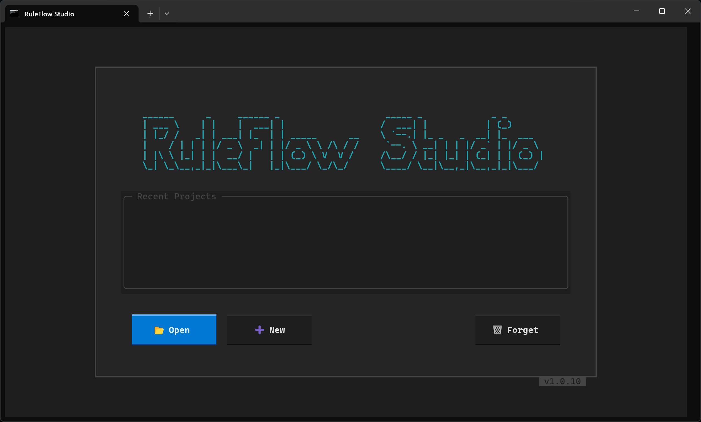
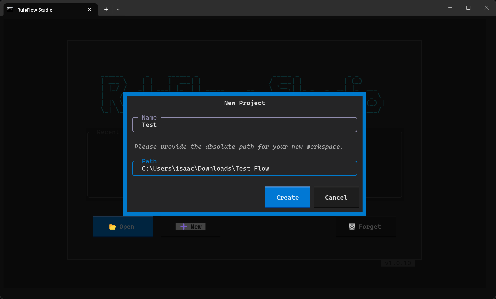
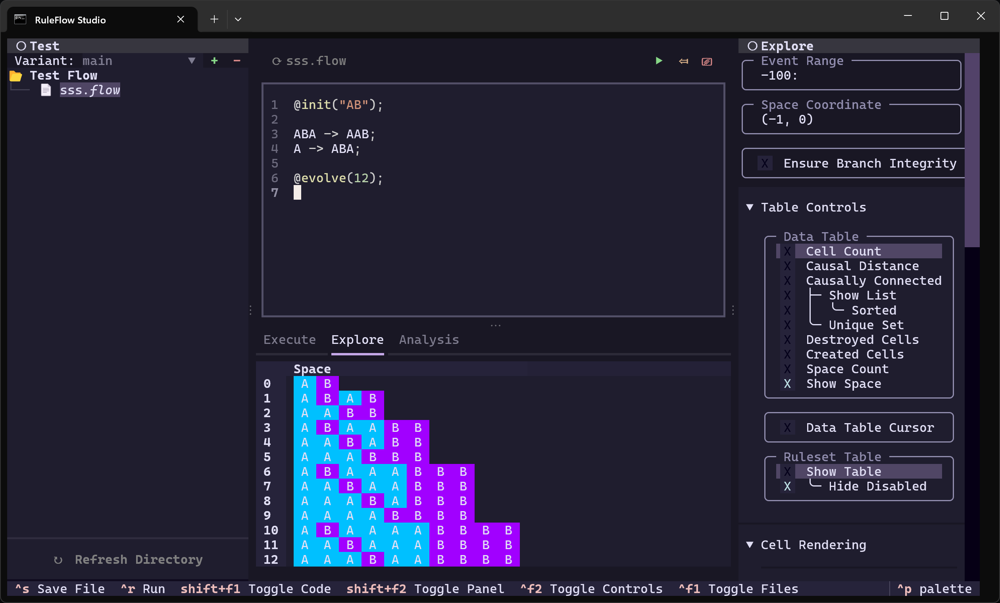

# First Steps

To begin, you need a dedicated folder on your computer to serve as your project workspace, along with a FlowLang file. 

## 1. Create Your First Workspace and File

1. **Create a Folder:** Create a new directory anywhere on your computer (for example, `Downloads/Test Flow`).
2. **Create a `.flow` File:** 
=== "Windows"
    Open the folder, right-click in the empty space, and select **New > Text Document**. Name the file `system.flow` and press Enter. *(Note: Ensure "File name extensions" is checked in your File Explorer View tab so you don't accidentally create `system.flow.txt`).*
=== "macOS / Linux"
    Open a plain text editor (like TextEdit, Gedit, or VS Code), create a new empty document, and save it into your folder as `system.flow`. Alternatively, open your terminal, navigate to the folder, and run `touch system.flow`.

## 2. Start a New Project

Launch RuleFlow Studio. You will be greeted by the main welcome screen.



Click the **New** button to initialize a project. A configuration dialog will appear.



Enter a name for your project, paste the absolute path to the workspace folder you created in the first step, and click **Create**. 

## 3. Write Your First System

Once the workspace loads, click your `.flow` file in the left sidebar to open the editor. Type the following FlowLang script into the file:

```python
@init("AB");

ABA -> AAB;
A -> ABA;

@evolve(12);
```

## 4. Execute and Evolve

Press the **Run** button in the top toolbar to execute the script. The engine will process the sequential substitution system and render the system in the main workspace.



---

Congratulations! You have successfully created and executed your first FlowLang system. You can now experiment with different rules, initial conditions, and evolution steps to explore the capabilities of RuleFlow.

[:material-download: Download Complete Examples Folder](https://download-directory.github.io/?url=https%3A%2F%2Fgithub.com%2FRuleFlow-OSS%2FRuleFlow%2Ftree%2Fmaster%2Ftests-manual%2Fexample-studio-project){ .md-button .md-button--primary }
